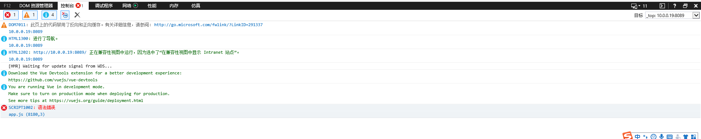
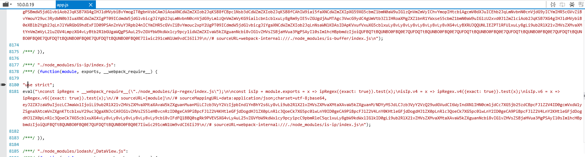

# edge已解决

1. edge 默认不允许本地ip访问 需要使用管理员身份打开cmd输入

   `CheckNetIsolation LoopbackExempt -a -n=Microsoft.MicrosoftEdge_8wekyb3d8bbwe`

# ie未解决，试验方式如下

1. babel-polyfill 需要在main中最先引入,在webpack.base.conf.js中去掉babel-polyfill引用，在main.js中引用jsoneditor，

2. babel-polyfill 需要设置useBuiltIns 为 entry,版本为>0.25%

  ```json
  "presets": [
  ​    [
  ​      "env",
  ​      {
  ​        "modules": false,
  ​        "targets": {
  ​          "browsers": [
  ​            "> 0.25%",
  ​            "last 2 versions",
  ​            "not ie <= 8"
  ​          ]
  ​        },
  ​        "useBuiltIns":"entry"
  ​      }
  ​    ],
  ​    "stage-2"
    ]```
3. ie中调试报错问题 （已解决）

`config/index.js 添加参数 disableHostCheck: true,`

4. ie版本默认为ie7问题（已解决）

`<meta http-equiv="X-UA-Compatible" content="IE=edge,chrome=1"/>`

5. 去掉除vue之外的所有引用，并在main.js中最前端加入打印语句，运行程序

   1. 打印语句未执行

   2. 控制台错误信息为

      

   3. 对应错误为"use strict";  行  "us 处出错

      
